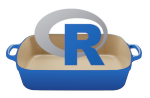

# roaster

## Introduction

This project is an attempt to design a new tiny tool to support 
[**R**](http://www.r-project.org), its users (**statisticians**, **data
scientists**) and **sysadmins**.

Basic features:

* get the latest R stable release;
* proceed with a _standard installation_;
* prepare a _server solution_;
* create _virtual environments_.

Virtual Environments are a new kind of R deployment in user-space. For
this specific case, the reference is Python virtualenv, and our goal is
replicate _as-close-as-we-can_ its main features.

## Support

How to create *virtual environments*:

* [Virtual environments in user space](docs/build-virtualenv.md)
* [Customizable options](docs/build-virtualenv-options.md)

How to make a *standard installation*:

* [Standard installation in your system](docs/build-standard.md)
* [Customizable options](docs/build-standard-options.md)

How to prepare a *server solution*:

* [Server installation in your system](docs/build-server.md)
* [Customizable options](docs/build-server-options.md)

---
Tested on Debian GNU/Linux 10. Fill issues for bugs or new features.
